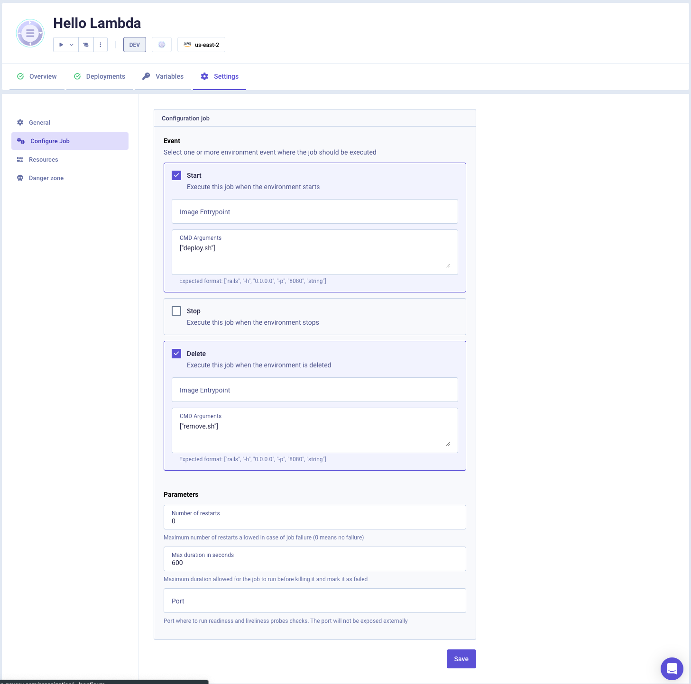

# Serverless Framework AWS NodeJS Example with Qovery

This example shows how to deploy a Serverless Framework AWS NodeJS application with Qovery Lifecycle Job.

## Important Notes

We use the plugin `serverless-manifest-plugin` (`serverless.yml` file) to generate the `serverless-manifest.yml` file. This file is used by the Qovery Lifecycle Job to inject back the `HELLO_FUNCTION_ENDPOINT_URL` environment variable. 

To install this plugin we use the command:

```shell
serverless plugin install -n serverless-manifest-plugin
```

Then we can run the command `serverless manifest --json` to generate the manifest in a JSON format. The command `serverless manifest -p qovery-output.js` will generate our `/qovery-output/qovery-output.json` file used by the [Lifecycle Job output](https://hub.qovery.com/docs/using-qovery/configuration/lifecycle-job/#job-output).

## How to use

First, you need to set the following environment variables:
- `AWS_ACCESS_KEY_ID`: your AWS access key ID
- `AWS_SECRET_ACCESS_KEY`: your AWS secret access key
- `AWS_REGION`: your AWS region where you want to deploy your application
- `QOVERY_ENVIRONMENT_ID`: your Qovery environment ID
  - **Local**: You can put a random alphanumeric value for local testing
  - **Qovery**: This environment variable is set automatically by Qovery


To test locally this Serverless Framework example, run the following commands:

```shell
docker build -t aws-lambda-with-serverless .
```

To deploy your application:

```shell
docker run \
  -e AWS_ACCESS_KEY_ID=<YOUR_AWS_ACCESS_KEY_ID> \
  -e AWS_SECRET_ACCESS_KEY=<YOUR_AWS_SECRET_ACCESS_KEY> \
  -e AWS_REGION=us-east-1 \
  -e QOVERY_ENVIRONMENT_ID=1234567890 \
  -it --entrypoint /bin/sh aws-lambda-with-serverless \
  -c "serverless deploy --stage \$QOVERY_ENVIRONMENT_ID"
```

To delete your application:

```shell
docker run \
  -e AWS_ACCESS_KEY_ID=<YOUR_AWS_ACCESS_KEY_ID> \
  -e AWS_SECRET_ACCESS_KEY=<YOUR_AWS_SECRET_ACCESS_KEY> \
  -e AWS_REGION=us-east-1 \
  -e QOVERY_ENVIRONMENT_ID=1234567890 \
  -it --entrypoint /bin/sh aws-lambda-with-serverless \
  -c "serverless remove --stage \$QOVERY_ENVIRONMENT_ID"
```

To show your application endpoint:

```shell
docker run \
  -e AWS_ACCESS_KEY_ID=<YOUR_AWS_ACCESS_KEY_ID> \
  -e AWS_SECRET_ACCESS_KEY=<YOUR_AWS_SECRET_ACCESS_KEY> \
  -e AWS_REGION=us-east-1 \
  -e QOVERY_ENVIRONMENT_ID=1234567890 \
  -it --entrypoint /bin/sh aws-lambda-with-serverless \
  -c "serverless manifest --stage \$QOVERY_ENVIRONMENT_ID --json"
```

## Qovery

To inject back environment variables via Qovery Lifecycle Job output:

Start Event CMD Arguments: 
```shell
["-c","serverless deploy --stage \$QOVERY_ENVIRONMENT_ID && serverless manifest --stage \$QOVERY_ENVIRONMENT_ID -p qovery-output.js"]
```

Delete Event CMD Arguments:
```shell
["-c","serverless remove --stage \$QOVERY_ENVIRONMENT_ID"]
```


